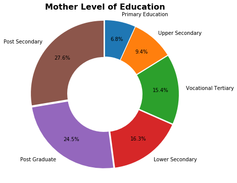
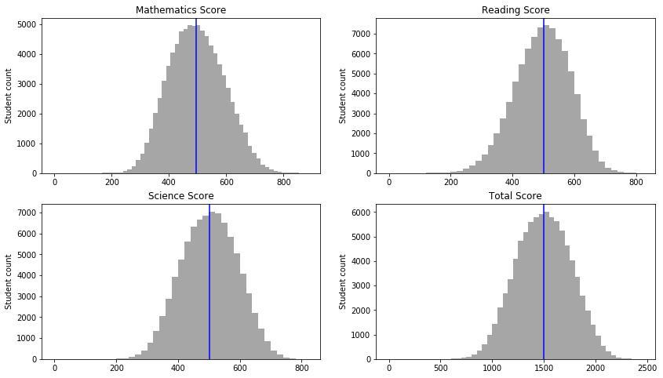
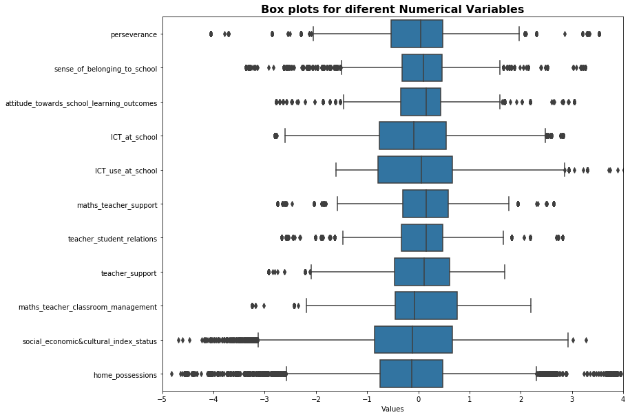
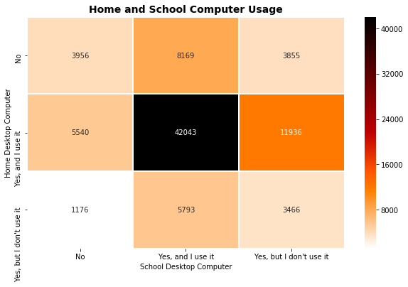
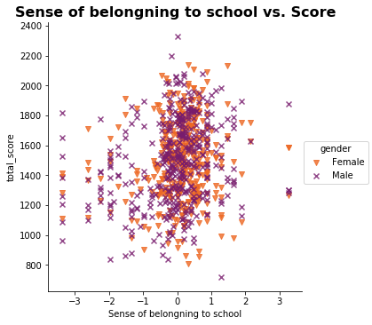

# Pisa2012 Data Exporation

## by David Owino

## Project Overview

This project has two parts that demonstrate the importance and value of data visualization techniques in the data analysis process.

- Part I, **Exploratory data visualization** uses Python visualization libraries to systematically explore the pisa2012 dataset, starting from plots of single variables and building up to plots of multiple variables.

- Part II, **Explanatory data visualization** include a short presentation that illustrates interesting properties, trends, and relationships discovered in the dataset by transforming exploratory visualizations from the first part into polished, explanatory visualizations.

## What do I need to install?

- Anaconda distribution to install Python, since the distribution includes all necessary Python libraries as well as Jupyter Notebooks. 
- NumPy
- pandas
- Matplotlib
- Seaborn

## Significant of the project - Why this project?

Data visualization is an important skill that is used in many parts of the data analysis process.

Exploratory data visualization occurs during and after the data wrangling process and is the main method that is used to understand the patterns and relationships present in the data. This understanding helps in statistical analysis, building conclusions, and findings. During this process, additional data cleaning will still be performed.

Explanatory data visualization techniques are used after generating findings and are used to help communicate results to others. Besides producing good visualizations, this project will also help one to be a good consumer of visualizations.

## Part 1 - Exploratory Data Analysis

In this part, I will perform an exploratory data analysis on the **_pisa2012_** dataset using Python and data visualization libraries. The aim is to explore the variables in the dataset, comprehend the data structure, oddities, patterns, and relationships. This analysis follows a structured path, starting with basic univariate relationships and ending with multivariate relationships.

I will begin with preliminary data wrangling to understand the data structure and brainstorm some more questions and record which features are of interest to the investigation and those which will help support that investigation. I will adopt the **_Question-Visualization-Observations_** framework, which involves asking a question from the data, creating a visualization to find answers, and then recording observations and systematically follow Univariate, Bivariate, and Multivariate Data Exploration.

## Univariate Exploration

> This section investigates the distributions of individual variables for unusual points or outliers. The features of interest are divided into two, categorical and numeric variables. For categorical variables, count plots, pie charts, donut plots, waffle counts, and bar graphs are used. The distributions of numeric variables of interest are investigated using histogram, and box plots.

## Part 2 - Explanatory Data Visualization

This involves updating the README file, summarising the steps used in data exploration and writing the key _Insights_ for Presentation. 

Two methods are used in this case: (a) **Generating Explanatory Data Visualizations** where I will generate explanatory data visualizations to tell a story about the data explored and (b) **Creating Slide Deck** by converting the notebook file.

## Dataset Description

The pisa2012 data, is a csv file is contained in a compressed zip file. The csv file is about 2.75GB when extracted. It contains data from 485490 sampled students with 636 features. The dataset contains the results from mathematics, science, readings, and financial literacy examinations as well as students' age, country of residence, family possessions, school, and home ICT facilities, first language, education level of the father and mother, occupations, and students' interests and motivations. The dataset can be found in the Udacity servers [here](https://s3.amazonaws.com/udacity-hosted-downloads/ud507/pisa2012.csv.zip), with feature documentation available [here](https://s3.amazonaws.com/udacity-hosted-downloads/ud507/pisadict2012.csv). Feature documentation, named pisadict2012.csv is 35.4kB containing 636 coded column names and their descriptions.

International Student Assessment (PISA) is a program initiated by OECD member states to measure how well 15-year-old students at the end of their compulsory schooling are prepared to address today’s challenges affecting societies. The assessment takes place after every three years and only focuses on the student's ability to use the skills and knowledge acquired at school to solve real-life challenges. PISA is an age-based survey, assessing 15-year-old students in school in grade 7 or higher. About 510,000 students in 65 economies took part in the PISA 2012 assessment of reading, mathematics, science, and financial literacy representing about 28 million 15-year-olds globally. The database also includes students' responses to Questionnaires that they completed as part of the assessment. Of those economies, 44 took part in an assessment of creative problem solving and 18 in an assessment of financial literacy.[here](https://www.oecd.org/pisa/pisaproducts/PISA-2012-technical-report-final.pdf)

## Data Wrangling

This involves gathering, assessing and cleaning the data

> **_Assessing Data_** where the data is assessed visually and programmatically for quality and tidiness issues. **Quality issues** are issues related to the data content (dirty data). We check for four quality diemnsions, completeness, validity, accuracy and consistency. **Tidiness issues** are issues related to the data structure (messy data). We check whether or not each variable forms a column, each observation forms a row or each type of observational unit forms a table

> **_Cleaning Data_** aims to improve the quality and tidiness by correcting the inaccuracies, removing the irrelevant columns, renaming columns and replacing missing values, or droping rows with the missing values based on the assessment already done. Cleaning data uses programmatic data cleaning process, in which every issue identified in the assessment section is first defined followed by codng and testing.

## Summary of Findings

The project investigates how different factors influence performance among students in different regions, which are either members of OECD or Non-OECD. In the exploration, I found that there was a strong linear relationship between student scores and social, economic, and cultural status. This relationship was investigated using only countries in the transcontinental region, which are members of OECD. Moreover, further exploration through multivariate visualization reveals that the the choice of a school play into academic performance as such students scores are high in schools with desktop computer, which are used by students. It is also observed that in grade 12, students who access or are in schools with desktop computers but don't use them have the lowest scores as compared to the performance of students who are in schools with no desktop computers. The score for students who use school computers has remained high in all the grades.

Other interesting results I found using the same logarithmic transform of the score is that perseverance has a slight effect on student performance among countries in Northern Europe while home possessions have a positive impact on student performance among OECD countries in Western Europe. In addition, teacher-student relations and student sense of belonging to school also influence students' scores in certain regions. This is because, a lot of data tend to concentrate from zero to 1, which may suggest that positive relations between students and teachers, as well as teachers' support, have a positive impact on student scores. However, it is important to note that, there is no significant difference in performance among females and males as well as between OECD and non-OECD.

Outside of the main variables of interest, I verified the relationship between parental educational level and student performance, which indicated that students who scored high have parents who attained either post-secondary or post-graduate education. It is also significant to note that in the case of gender, about 33 percent of female students access and use desktop computers at school compared to 32 percent of male students. In addition, whereas the median performance is the same in both OECD and Non-OECD countries, many students scored between 25% and 75% scores in non-OECD than in OECD countries. Comparing home possessions and parent level of education, it is clear from the visualization that a lower education level implies a low score for home possession.

## Key Insights for Presentation

At first, I introduce the distribution of scores on a histogram plot followed by a box plot for other numeric attributes that affect scores. These attributes include perseverance, student sense of belonging to a school, ICT usage at school, teacher-student relations, teacher support, social, economic, and cultural status index, and home possessions. 

I then introduce counts for the parent level of education using a donut chart for the father's education and waffle counts for the mother's education level. I also create a bar plot for the percentage proportion of students who took the Pisa test per grade and then I compare the counts for home and school desktop computer usage on a heatmap followed by the scatterplot pattern for numeric attributes that affect student scores in different regions.
 
Afterward, I introduce the performance of each of the categorical variables one by one and pairwise. To start, I use the bar plots for gender, OECD, and country performance. I then use a point plot to compare if there are any variations in performance between gender and grade, and between grade and school computer usage. I also examine whether perseverance, teacher-student relations, and a sense of belonging to school affect gender scores using hist2d and lmplot, and finally whether parent level of education influences student scores. I've made sure to use different color palettes for each quality variable to make sure it is clear that they're different between plots.

### Question: What is the percentage proportion for the level of education for the mother?

In this case, I used a donut plot to show different categories within the mother education level column

The majority of the mothers had post-secondary and post-graduate education.

### Question: How many students access computers at home and school and use them?
I used a bar graphs

The number of students who access and use computers at school and home exceeds those who access and don't use them as well as those who don't have access to computers at all

### Question: What is the distribution of the scores?

I used histogram to check the distribution, normality or skewness of scores per each subject category as well as total_score.

All the distributions for the scores are normal

### Question: What is the distribution of other numeric variables?

I used box plot to maintain the distribution of quantitative variables in the data.

All the numeric columns have outliers. Whereas most of the features are normally distributed, perserverence, attitude of the students towards the school, ICT used at school, and mathematics teacher classroom management are slightly skewed.

## Bivariate Exploration

> This section investigates relationships between pairs of variables in the data. The distribution of all the variables under this section has been explored under univariate exploration. Heatmaps, bar plots, regplots, violin plots, and box plots are used in this section.

### Question: What is the total number of students who access and use a computer at school and home?

I used heatmap to show relationships between the use of home desktop computer and school desktop computer by students.

The number of students who access and use computers is 42043, which is higher than those who don't use a computer at home whether they access the computers or not.

## Socio-Economic and Social status index vs. Performance

## Home possessions vs. Score

### Question: How does the use of a school desktop computer affect scores for different ages?

I used point plot

Students who have no access to computer have constant low scores across all grades.

### Question: How does the use of a school desktop computer affect scores for different ages?

Male students in grade 7 performed lower than those in grade 12 compared to their female counterparts. There is no significant difference in scores among female and male students in the other grades.

### Question: How do teacher-student relations and students' sense of belonging to school among affect gender performance?

I used faceted heat maps

Performance of male students seems to be positively influenced by teacher-student relations as compared to female students while there are no significant differences in performance in the case of student's sense of belonging to school.

The relationship between teacher-student relations and a sense of belonging is a linear trend for both males and females as well as among the OECD members and non-members.

Performance of male students seems to be positively influenced by sense of belonging to school as compared to male students while that of female students seems to be positively influenced by teacher-student relations as compared to male students

## What I have learnt?

I am able to:

- Supplement statistics with visualizations to build understanding of data.
- Choose appropriate plots, limits, transformations, and aesthetics to explore a dataset, allowing you to understand distributions of variables and relationships between features.
- Use design principles to create effective visualizations for communicating findings to an audience.
